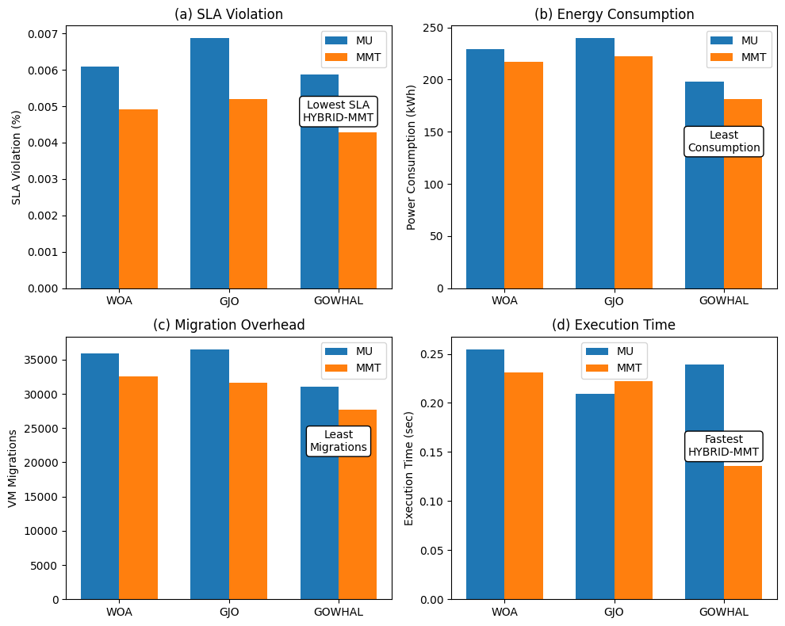

# Energy-Efficient Virtual Machine Allocation Using GOWHAL Algorithm

## Overview
This project implements an energy-efficient Virtual Machine (VM) allocation strategy for cloud data centers using metaheuristic optimization algorithms in CloudSim.

The repository evaluates and compares:
- Golden Jackal Optimization (GJO)
- Whale Optimization Algorithm (WOA)
- Hybrid GJO-WOA allocation strategy (GOWHAL)

Each allocation strategy is tested with:
- Minimum Utilization (MU) VM selection
- Minimum Migration Time (MMT) VM selection

The objective is to reduce:
- Data center power consumption
- SLA violations
- Unnecessary VM migrations

All simulations are executed on PlanetLab workload traces in CloudSim.

---

## Key Features
- Metaheuristic-based VM allocation policies
	- GJO-based allocation
	- WOA-based allocation
	- Hybrid GJO+WOA allocation (GOWHAL)
- Selection policies
	- MU (Minimum Utilization)
	- MMT (Minimum Migration Time)
- Performance comparison with graph-based analysis
- PlanetLab workload-driven simulation setup

---

## Tech Stack
- Language: Java
- Framework: CloudSim (PlanetLab power-aware simulation flow)
- Platform: Windows / Linux

---

## Repository Structure
```text
Energy-Efficient-VM-Allocation-Using-GOWHAL-Algorithm/
|-- LICENSE
|-- README.md
|-- Results/
|   |-- HYBRID ARCH.png
|   `-- Graphs/
|       |-- Final_Comp.png
|       |-- MMT_Graph.png
|       `-- MU_Graph.png
`-- src/
		|-- GJO_mmt.java
		|-- GJO_mu.java
		|-- Hybrid_mmt.java
		|-- Hybrid_mu.java
		|-- PowerVmAllocationPolicyMigrationGJO.java
		|-- PowerVmAllocationPolicyMigrationHybridGJOWOA.java
		|-- PowerVmAllocationPolicyMigrationWhaleOptimization.java
		|-- whalemmt.java
		`-- whalemu.java
```

---

## Algorithms and Entry Classes
Use the following main classes to run experiments:
- GJO + MMT: `GJO_mmt`
- GJO + MU: `GJO_mu`
- Hybrid (GJO-WOA) + MMT: `Hybrid_mmt`
- Hybrid (GJO-WOA) + MU: `Hybrid_mu`
- WOA + MMT: `whalemmt`
- WOA + MU: `whalemu`

Each class uses workload `20110303` and calls `PlanetLabRunner` with the selected VM allocation and VM selection policy.

---

## How to Run
1. Clone the repository
```bash
git clone https://github.com/ABHIRAM3046/Energy-Efficient-VM-Allocation-Using-GOWHAL-Algorithm.git
cd Energy-Efficient-VM-Allocation-Using-GOWHAL-Algorithm
```

2. Set up CloudSim
- Use a CloudSim project that includes `PlanetLabRunner` and the power-aware PlanetLab example environment.
- Place these `src` files into the appropriate CloudSim examples package:
	`org.cloudbus.cloudsim.examples.power.planetlab`

3. Compile
```bash
javac -cp ".;lib/*" -d out src/*.java
```

4. Run a scenario (example)
```bash
java -cp ".;lib/*;out" org.cloudbus.cloudsim.examples.power.planetlab.Hybrid_mmt
```

Run any of the other main classes listed above to compare algorithms and selection policies.

---

## Workflow


---

## Results
Simulation outputs and comparison plots are available in:
- `Results/Graphs/MMT_Graph.png`
- `Results/Graphs/MU_Graph.png`
- `Results/Graphs/Final_Comp.png`

Sample results visualization:



---

## Final Results Summary
| Algorithm | Policy | SLA Violation (%) | Power Consumption (kWh) | VM Migrations | Execution Time (sec) |
|---|---|---:|---:|---:|---:|
| DVFS | - | 0.00 | 803.91 | 0 | - |
| WOA | MU | 0.00608 | 229.23 | 35898 | 0.25476 |
| WOA | MMT | 0.00492 | 217.01 | 32561 | 0.23129 |
| GJO | MU | 0.00687 | 239.67 | 36531 | 0.20964 |
| GJO | MMT | 0.00519 | 222.16 | 31679 | 0.22229 |
| Hybrid GJO-WOA | MU | 0.00588 | 198.34 | 31005 | 0.239195 |
| Hybrid GJO-WOA | MMT | 0.00429 | 181.38 | 27677 | 0.13594 |

---

## Future Work
- Add adaptive parameter tuning for GJO/WOA over dynamic workloads
- Evaluate on additional workload traces and larger host pools
- Compare with additional baseline allocation policies

---

## License
This project is licensed under the MIT License. See `LICENSE` for details.
